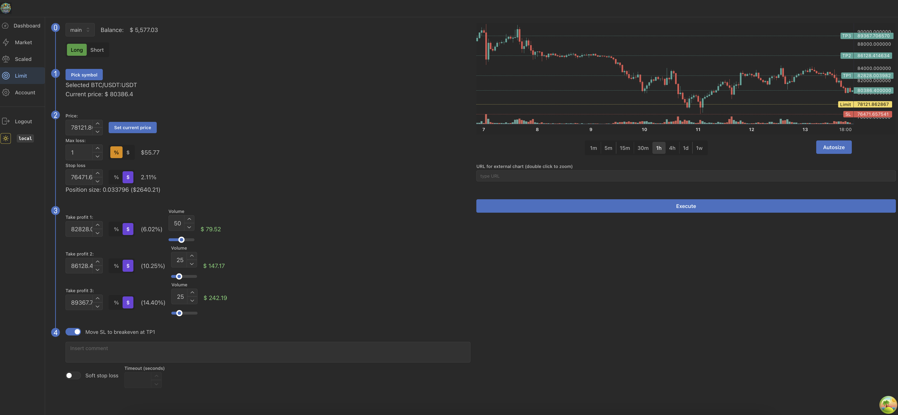
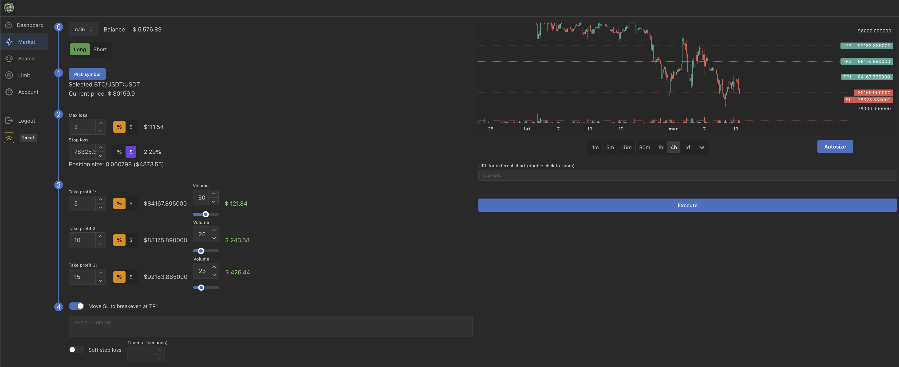
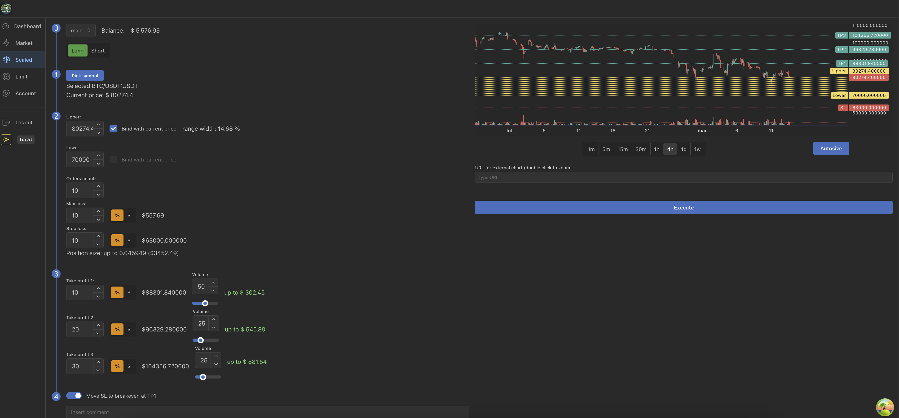

# MiamiTrade

MiamiTrade is a cryptocurrency trading platform with risk management built in as a first priority.

Compared with ordinary exchanges that persuade you to increase risks during trading, in MiamiTrade you can easily set
how much you're willing to risk for each trade.

Live version accessible via https://miamitrade.pro

## Features

Create various types of positions (listed below).

Each one of them allows to easily calculate position size, basing on the % of your portfolio that you're willing to
loose.

### Limit order

Creates a position at a given price tag

### Market Order

Starts the position immediately using current price

### Scaled Order

Sets bunch of limit orders spaced out between set bounds

# Development

## Frontend

MiamiTrade's frontend is a React / Next.js application

## Backend

Backend is divided into 2 main components:

- REST and Websocket API's powered by Flask
    - backend for frontend
- Data harvester agents
    - for gathering market data straight from the exchanges, so they could be easily used
      locally (and not depend on exchange usage quotas)

## Deployment

Both fronted and backend are isolated into separate containers and served using Docker Swarm.

Configuration of these can be found in corresponding docker-compose `yml` files from the main directory

# Roadmap

## Features

### UI

- [x] Open new limit position
- [x] Open new market position
- [x] Open new scaled position
- [x] Support for graphical drag & drop charts
- [x] Support for soft SL
- [x] Support for multiple accounts
- [ ] View current position screen
- [ ] Ability to group active positions into folders
- [ ] Ability to quickly close x% of the selected position and set SL to breakeven
- [ ] Integrate with Advanced Charts from Tradingview.com
- [ ] Mobile app

### Backend

- [x] Harvest historical OHLCV data
- [x] Harvest realtime OHLCV data
- [x] Harvest funding data
- [x] Harvest open interest data
- [ ] Harvest historical / realtime trades and convert them to OHLCV on demand

## Exchanges support

- [x] Bybit (via 3commas.io)
- [ ] Binance (via 3commas.io)
- [ ] Binance (via 3commas.io)
- [ ] OKX (via 3commas.io)
- [ ] Gate.io (via 3commas.io)
- [ ] Bybit (native support)
- [ ] Binance (native support)
- [ ] Binance (native support)
- [ ] OKX (native support)
- [ ] Gate.io (native support)